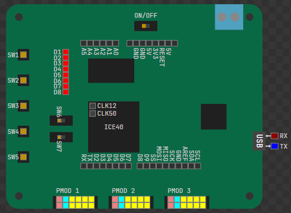
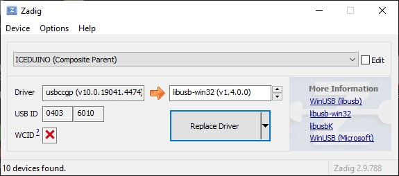

# ICEDuino 
Hardware support for the ICEDuino board in OneWare Studio
Hardware Repo: https://github.com/iceduino/iceduino

## Installation Guide

For Linux and MacOS, only the OSS Cad Suite needs to be installed and, if necessary, the GHDL plugin if you want to work with VHDL. 

The correct driver for the FTDI chip must be installed in Windows.
In Windows, there is currently a bug in the OSS Cad Suite with the OpenFPGALoader, which means that it does not work. However, there is a workaround by downloading the binaries from CologneChip AG, which also provides a compilation of the OpenFPGALoader in OneWare.

### Windows install driver

In Windows environments, it is necessary to install USB drivers using [Zadig](https://zadig.akeo.ie/). Download the software and connect the ICEDuino Board to your USB port.
In the Zadig Window, select Options > List All Devices to refresh the device list. 
Then, unmark Options > Ignore Hubs or Composite Parents. 
From the drop-down list, select ICDDuino (Composite Parent). 
Now select libusb-win32 (anyversion) from the driver list and replace the drivers.

[Source from CologneChip AG (Chapter 5.3)](https://www.colognechip.com/docs/ug1002-toolchain-install-latest.pdf)

### Change OpenFPGALoader (Only Windows)

As long as this issue remains unresolved, the following steps must be taken to achieve a functional setup with the OSS-CAD suite:

https://github.com/YosysHQ/oss-cad-suite-build/issues/179 

1. Also install the Cologne Chip Toolchain plugin in OneWare Studio. 
2. Under the ‘binaries’ tab in the extension window, it should be possible to download the current toolchain from Cologne Chip.
3. Download the toolchain

The OneWare Studio workspace is located under the user directory. For example, C:/Users/Peter/OneWareStudio

4. Copy this file `OneWareStudio\Packages\NativeTools\colognechip\cc-toolchain-win\bin\openFPGALoader\openFPGALoader.exe` in this folder `OneWareStudio\Packages\NativeTools\osscadsuite\oss-cad-suite\bin`.
5. Confirm in Explorer that you want to replace the existing file with the new one.